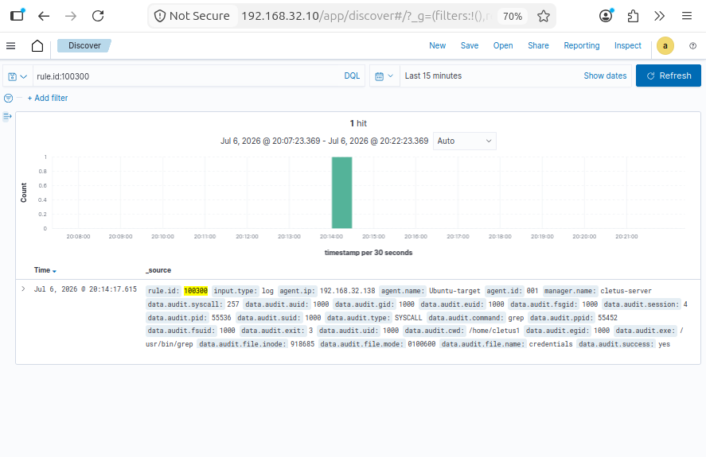
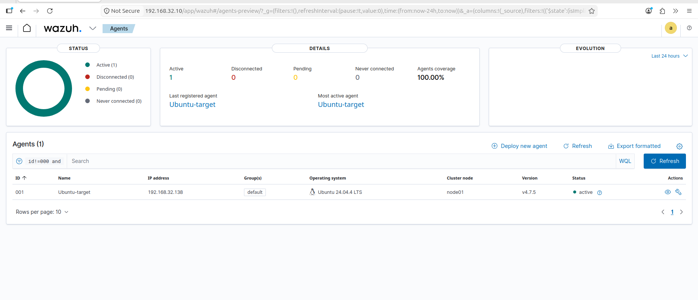
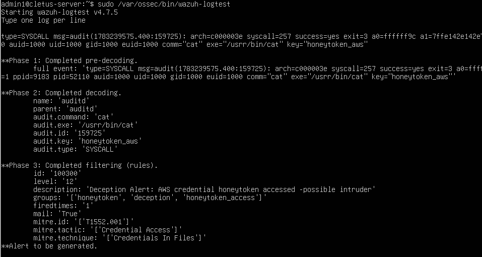
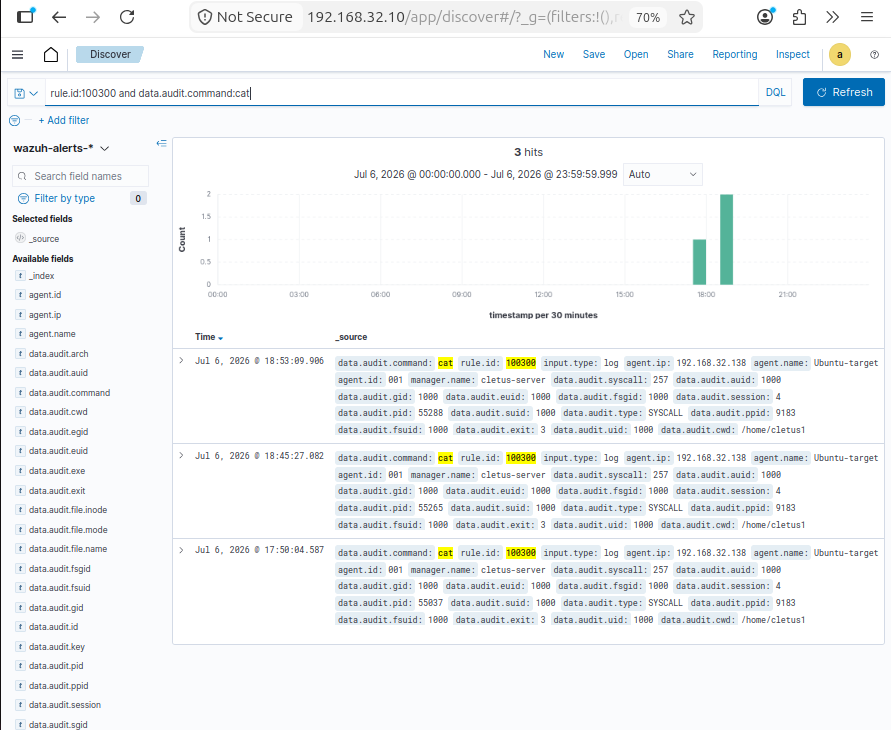

# Deception-Based Detection Engineering Lab

> **A detection with a near-zero false-positive rate - not because it was tuned, but because
> false positives are architecturally impossible.**

Most detection fights a losing battle against false positives: normal activity resembles
attacks, so analysts drown in noise. This project inverts the model. It plants a
**honeytoken** - a fake, valuable-looking AWS credentials file that *no legitimate user or
process ever has a reason to touch*. Any access to it is, by construction, an intruder. The
detection question stops being *"is this behavior bad?"* and becomes binary and certain:
**the bait was touched, therefore an intruder is present.**

Then I proved it - by attacking my own lab.



*A Wazuh level-12 alert fired with `data.audit.command: grep` - the honeytoken was read during
an automated credential sweep launched from a reverse shell, not a manual read. This is the
whole thesis, demonstrated against a live attack.*

---

## How it works

```
  Attacker reads the bait
          │
          ▼
  /home/cletus1/.aws/credentials        ← the honeytoken (fake AWS keys)
          │
          ▼
  auditd watch (key: honeytoken_aws)     ← OS-level: catches the READ (FIM can't)
          │
          ▼
  Wazuh agent  ──►  Wazuh manager
          │
          ▼
  Rule 100300 (level 12)  ──►  ALERT     ← mapped to MITRE T1552.001
  Rule 100301 (level 0)   ──►  suppress  ← ignores Wazuh's own FIM self-scans
```

The critical insight: credential theft is a **read**, and a read changes nothing - so File
Integrity Monitoring is blind to it. `auditd` is what makes a read-triggered honeytoken
possible.

## Lab architecture

| VM | Role | IP |
|----|------|----|
| Wazuh SIEM server | Detection brain / alert console | `192.168.32.10` (static) |
| Ubuntu 24.04 target | Victim host where the bait is planted | `192.168.32.138` (agent ID 001) |
| Kali attacker | Adversary emulation | same NAT segment |
| Analyst workstation | Triage & investigation | `SOC-Desktop` |



## The detection

Full design in **[`detections/ADS-001-aws-honeytoken.md`](detections/ADS-001-aws-honeytoken.md)**.
The rules themselves:

- **[`detections/wazuh/local_rules.xml`](detections/wazuh/local_rules.xml)** - rule 100300
  (alert) chained as a *child* of base rule 80700 via `<if_sid>`, plus rule 100301
  (suppression) for Wazuh's own `wazuh-syscheckd` self-scans.
- **[`detections/auditd/honeytoken.rules`](detections/auditd/honeytoken.rules)** - the
  persistent `auditd` read-watch that tags every access with `honeytoken_aws`.

**Suppression is part of the design, not an afterthought.** The zero-false-positive claim is
only real once the system ignores its *own* honeytoken reads while still alerting on
everything else: real read → level 12; FIM self-scan → level 0.

## Validation - two independent ways

**1. Unit test (`wazuh-logtest`).** A `cat` read decodes and matches rule 100300 (level 12,
"Alert to be generated"); a `wazuh-syscheckd` read matches rule 100301 (level 0, suppressed).
Deterministic and repeatable.



**2. Live attack (end-to-end).** From the Kali attacker: reverse shell → host discovery →
automated credential sweep. The sweep read the honeytoken as a side effect of ordinary
looting and rule 100300 fired with `command: grep`. Full chain in
**[`attack/attack-chain.md`](attack/attack-chain.md)**.



## Lessons learned

Real troubleshooting, captured as it happened:

- **Same-subnet ≠ same-segment.** The agent was healthy locally but `disconnected` at the
  manager. Systematic elimination (service, config, firewalls, forced-interface ping) plus a
  `FAILED` ARP entry isolated the cause: multi-homed VMs with matching IPs on *different*
  VMnets. Fix: one adapter per VM + a static SIEM IP.
- **Reads need auditd, not FIM.** FIM detects changes; reading credentials changes nothing.
- **Rule IDs must be unique.** A reused ID (100200) silently stopped the rule from running.
- **XML attributes take no space before `=`.** A stray space halted the entire manager.
- **Sibling vs. child rules.** `<decoded_as>` makes a rule a *sibling* that competes with base
  rules and never runs; `<if_sid>` makes it a *child* evaluated after the parent. `wazuh-logtest`
  reveals where analysis stops.
- **Decoders can transform field values.** Wazuh truncated the syscheckd exe path at the
  hyphen; the suppression rule had to match the *decoded* value (`/var/ossec/bin/wazuh$`).

## Limitations (stated honestly)

- **Offline/raw-disk reads** that bypass the audited syscall path generate no event.
- **auditd tampering** by a root-level attacker who disables the rule first defeats it.
- **Agent/manager availability** - if the pipeline is down at access time, no alert is raised
  until the event is forwarded.
- **Assumes the host runs no legitimate AWS workload** - true for this lab; a real AWS host
  would need a decoy profile or alternate path.

Full blind-spot analysis in [ADS-001 §5](detections/ADS-001-aws-honeytoken.md).

## What's next

A follow-on project will extend the deception layer: additional honeytokens (SSH-key canary,
honey-user, decoy password file), a portable Sigma version of ADS-001, detection-as-code CI,
and a MITRE ATT&CK Navigator coverage heatmap with gap analysis.

## Repository layout

```
deception-detection-lab/
├── README.md                          # this file
├── detections/
│   ├── ADS-001-aws-honeytoken.md      # detection design (goal, logic, blind spots, response)
│   ├── wazuh/local_rules.xml          # rules 100300 (alert) + 100301 (suppression)
│   └── auditd/honeytoken.rules        # persistent read-watch
├── attack/attack-chain.md             # Phase 4 live adversary emulation
├── docs/
│   ├── project-explainer.md           # plain-language overview
│   ├── project-log.md                 # full technical build log
│   └── HANDOVER.md                    # internal handover notes
└── evidence/                          # screenshots (01-11)
```

---

*All work performed in an isolated home lab for educational and authorized defensive use only.
All credentials used as bait are fake; attack simulation is run only against the operator's own
lab hosts. Detection maps to MITRE ATT&CK **T1552.001 - Unsecured Credentials: Credentials In Files**.*
